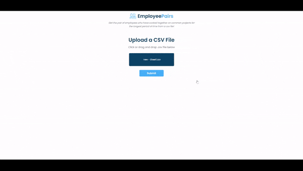

## Sirma Solutions Employee Task

Application that identifies the pair of employees who have worked together on common projects for the longest period of time.

## Solution Formulation

Steps I thought of and executed for solving the task:

1. A way to parse the .csv file - using a library called Papa Parse
2. Create a function that will handle the parsed data
   - Sorted the data in ascending order by ProjectID to make sure that employees with the same ProjectID are shown one after the other
   - Added each pair into a newly created object with pair(array), employee 1 days worked, employee 2 days worked and total days worked properties
   - Checked if the object is empty with Object.keys - return null if it is
   - Loop through each key of the object in order to calculate individual employee days worked (using a helper function) and total days worked
   - In the end sorted the data again, so that the pair with the highest total days worked is shown first and returned that pair
3. Added submit event listener to the form
   - Get the input and store it in a variable
   - Add guard clause if there is no input (file upload)
   - Used Papa parse to parse the input
   - Store the result from the function that handles the parsed data into a variable
   - Display the data into a table using the DOM

## Technologies and Libraries

- HTML
- CSS
- JavaScript
  - Papa Parse 5.0
  - Parcel

## Quick Preview

You can check out the app here:
<a href="https://dimitar-radulov-employees.netlify.app" target="_blank">EmployeePairs - Sirma Task</a>
